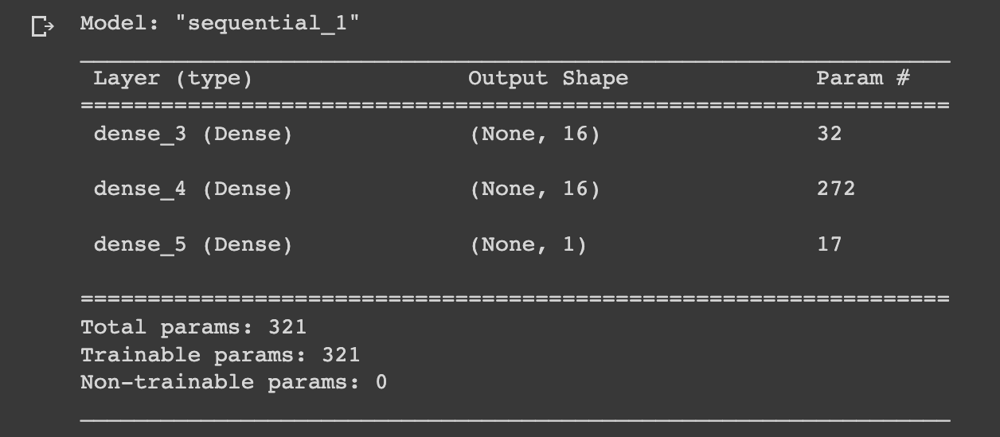
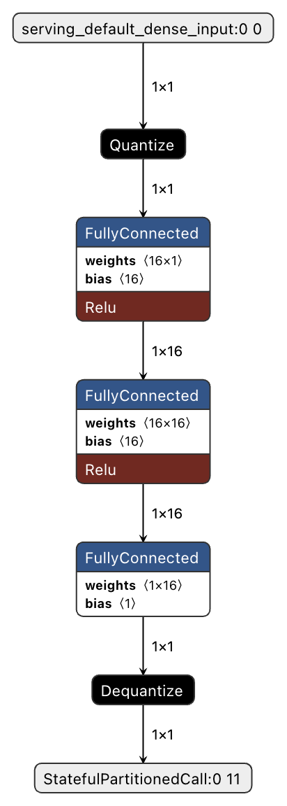

# Hello World TinyML
- Xin chào mn, trong bài này mình sẽ ghi lại các bước để tạo một dự án Hello World TinyML
    1. Mục tiêu: tính toán được mô hình sin với tín hiệu đầu vào
    2. Board: ESP32C3 dev kit module
# Mục lục
1. [Tạo mô hình sin bằng ML](#tạo-mô-hình-sin-bằng-ml)
2. [Tạo sandbox](#tạo-sandbox)
3. [Code ESP32 chạy ML](#code-esp32-chạy-ml)

## Tạo mô hình sin bằng ML
-   Để tạo mô hình sin bằng ML, mình sẽ dùng Google Colab để xây dựng mô hình ML.
-   Do tính chất của dự án Hello World, mình sẽ tự tạo ra data của x bằng hàm ``np.random.uniform``. Data của x sau đó sẽ được suffle và tính toán ra y.
```python
# Number of samples
SAMPLE = 3000
# Numpy seed set how many number will remain when run again
SEED = 1024
# set seed
np.random.seed(SEED)
tf.random.set_seed(SEED)
# set random value x
x_values = np.random.uniform(low=0, high=2*math.pi, size=SAMPLE)
# suffle x
np.random.shuffle(x_values)
# calculate sine wave
y_values = np.sin(x_values)
```
- Nếu mn muốn xem data của ra sao thì plot bằng matplotlib theo các lệnh sau:
```python
# Plot x and y value 
plt.plot(x_values, y_values, 'b.')
plt.show()


y_values += 0.1*np.random.randn(*y_values.shape)
plt.plot(x_values, y_values, 'b.')
plt.show()
```
- Sau khi data đã sẵn sàng, ta sẽ tách data thành 6-2-2. 60% cho việc trainning, 20% cho validation và 20% cho test. Như vậy data đã sẵn sàng.
```python
TRAIN_SPLIT = int(0.6*SAMPLE)
TEST_SPLIT = int(0.2*SAMPLE + TRAIN_SPLIT)

x_train, x_validate, x_test = np.split(x_values, [TRAIN_SPLIT, TEST_SPLIT])
y_train, y_validate, y_test = np.split(y_values, [TRAIN_SPLIT, TEST_SPLIT])


assert(x_train.size + x_validate.size + x_test.size) == SAMPLE
```
- Plot ra:
```python
plt.plot(x_train, y_train, 'b.', label="Train")
plt.plot(x_validate, y_validate, 'r.', label="Validate")
plt.plot(x_test, y_test, 'y.', label="Test")
plt.legend()
plt.show()
```
- Khi data đã có, mình sẽ tạo ML model
```python
from tensorflow.keras import layers

model = tf.keras.Sequential()

model.add(layers.Dense(16, activation='relu', input_shape=(1,)))
model.add(layers.Dense(16, activation='relu'))
model.add(layers.Dense(1))

model.compile(optimizer='rmsprop', loss='mse', metrics=['mae'])

model.summary()
```

- Mình sẽ sử dụng mạng Neuron với hàm relu. Các bạn cứ thử mô hình của riêng mình
- Mạng Neuron của mình có: (1 * 16) + (16 * 16) + ( 16* 1) = 288 weights và 16 + 16 + 1 = 33 bias, tổng cộng: 288 + 33 = 321 parameters
- Tiếp theo thì ném data vô train và ngồi đợi thôi
```python
history = model.fit(x_train, y_train, epochs=600, batch_size=16, validation_data=(x_validate, y_validate))
```
- Khi train xong, ta luôn phải đánh giá mô hình ML bằng 1 hoặc nhiều phương pháp khác nhau. Do đây chỉ là Hello World nên mình sẽ chỉ vẽ cái hình loss của tập trainning và validation.

- Bước tiếp theo là chuyển đổi mô hình thành .tflite và cuối cùng là .cc
```python
# Convert the model to the Tensorflow Lite format without quantization
converter = tf.lite.TFLiteConverter.from_keras_model(model)

tflite_model = converter.convert()

open("sine_model.tflite", "wb").write(tflite_model)

# Convert the model to the Tensorflow Lite format with quantization
converter = tf.lite.TFLiteConverter.from_keras_model(model)

converter.optimizations = [tf.lite.Optimize.DEFAULT]

def representative_dataset_generator():
  for value in x_test:
      yield [np.array(value, dtype=np.float32, ndmin=2)]


converter.representative_dataset = representative_dataset_generator
tflite_model = converter.convert()

open("sine_model_quantized.tflite", "wb").write(tflite_model)

# Compare mode size with or without quantized
basic_model_size = os.path.getsize("sine_model.tflite")
print('Basic model size: ', basic_model_size)
quantized_model_size = os.path.getsize("sine_model_quantized.tflite")
print('Quantized model size: ', quantized_model_size)
diff = basic_model_size - quantized_model_size
print('Diff: ', diff)
```
- Chuyển đổi thành file .cc:
```python
# Install xxd if it is not available
!apt-get -qq install xxd
# Save the file as a C source file
!xxd -i sine_model.tflite > sine_model.cc
# Save the file as a C source file
!xxd -i sine_model_quantized.tflite > sine_model_quantized.cc
# Print the source file
!cat sine_model_quantized.cc
```
- Các bạn có thể xem thêm qua Google Colab của mình:
[link](https://colab.research.google.com/drive/1XMIrPA2p-tczsnA3RZ1DQ9mmTJvOJJjC?usp=sharing)
## Tạo sandbox
- Cách tạo sandbox và cấu trúc của sandbox có thể xem ở đây: [link](https://docs.espressif.com/projects/esp-idf/en/latest/esp32/api-guides/build-system.html?highlight=projbuild#example-project)
- Sandbox của mình có cấu trúc như sau
```
---build
---compomnents
------tflite
---------signal
---------tensorflow
---------third_party
---------CMakeLists.txt
---main
------sine_model_quantized.hpp
------sine_model_quantized.cc
------CMakeLists.txt
------constants.hpp
------constants.cpp
------hello_world_tflite.cpp
---CMakeLists.txt
```
- ``./build`` sẽ được tạo khi chạy lệnh build của esp idf
- ``signal``, ``tensorflow``, ``third_party``: đây là các thư viện của tensorflow lite, mọi người đọc file readme trong ./component/tflite để biết cách generate thư viện.
- ``sine_model_quantized.cc`` trained model generate từ googl colab
- ``constants.cpp`` chứa các const variable của code
## Code ESP32 chạy ML
- Trước khi nhảy vào code esp32, mình khuyên mọi người nên dùng app [neuron](https://netron.app/) để check model của mình.
- Model của mình như hình dưới đây



- Sau khi biết cấu trúc model được gen ra sau thì nhảy vào code thôi
- Code cho ESP32 gồm 2 task: Task init và cyclic task (ở đây thì mình dùng vòng while vô tận)
### Task init
- Việc đầu tiên cần làm là import model
```C++
model = tflite::GetModel(sine_model_quantized_tflite);
```
- Tiếp theo là tạo biến static resolver và add các layer theo cấu trúc model mình đã check ở trên
```C++
static tflite::MicroMutableOpResolver<3> resolver;
if (resolver.AddQuantize() != kTfLiteOk) {
   return;
}
if (resolver.AddFullyConnected() != kTfLiteOk) {
   return;
}
if (resolver.AddDequantize() != kTfLiteOk) {
   return;
}
```
- Khởi tại biến static interpreter
```C++
static tflite::MicroInterpreter static_interpreter(
        model, resolver, tensor_arena, kTensorArenaSize);
interpreter = &static_interpreter;
```
- Cuối cùng là check thử vùng memory mình cấp cho việc chạy ML có bị overload không
```C++
TfLiteStatus allocate_status = interpreter->AllocateTensors();
if (allocate_status != kTfLiteOk)
{
    MicroPrintf("allocate_tensor() failed");
    return;
}
```
### Task cyclic
- Do model đã có layer quantized và dequantized nên đầu vào và đầu ra của ``interpreter`` sẽ là số float. Để tạo số float x, mình dùng công thức current_cycle/cycle. Ở đây cycle mình là 40.
```C++
const int kInferencesPerCycle = 40;
```
- ```input``` và ```output``` của ```interpreter```
```C++
float x = position * kXrange;
input->data.f[0] = static_cast<float>(x);

float y = output->data.f[0];
```
- Sau cùng là tăng current_cycle và check đã bằng cycle chưa
```C++
inference_count += 1;
if (inference_count >= kInferencesPerCycle) inference_count = 0;
```
## Build SW
- Chạy lệnh sau để compile và build sw:
```bash
idf.py set-target esp32s3
idf.py build
```
- Nhớ thay ```esp32s3``` bằng dev kit hoặc esp32 của các bạn nha
- Sau đó kiểm tra port serial
   - MAC OS: ls /dev/cu.*
   - Linux: ls /dev/tty*
- Flash xuống board:
```bash
idf.py -p PORT [-b BAUD] flash
```